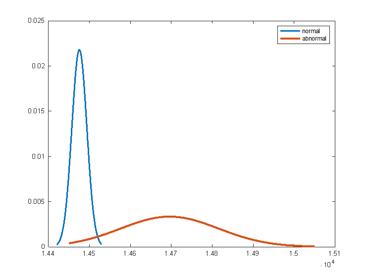

# 数据预处理（清洗）
## 任务描述
无论是信号无干扰下采集数据，或信号干扰下采集数据，Tag在同一坐标点上都采集多组数据 **（同级目录中上传了“1.正常.txt”作为示例）**，请用某种方法把每个数据文件相应数值抓取出来，并转换成二维表（矩阵）形式（txt、Excel或其他数据格式），每一行代表一组数据（即一个样品），然后对这些数据文件进行预处理（清洗），删除掉一些“无用”（异常、缺失、相同或相似）的数据（样品）。经处理后，“正常数据”所有数据文件和“异常数据”所有数据文件最后各保留多少组（多少个样品）数据？
## 任务分析
无论是信号无干扰下采集数据，或信号干扰下采集数据，Tag在同一坐标点上都采集多组数据。由于在数据采集过程中，会出现由实验器材或环境等不可控因素的影响，数据测量、数据记录、数据 导出等过程中难免会存在一定问题，造成数据的异常，缺失，相同或类似等情况，最终会导致采集的原始数据中存在着或多或少的不良数据，包括连续或间断性的数值缺失、数值漂移（异常大或小）等情况。
### 漂移
在读取两个文件夹中的正常和异常数据时，发现部分采集点都存在靶点（Tag）到四个锚点中某一个的距离突然极小（例如仅为70mm），这便是无效的漂移数据，应该予以剔除。
### 3σ准则（拉依达准则）
拉依达准则是指先假设一组检测数据只含有随机误差，对其进行计算处理得到标准偏差，按一定概率确定一个区间，认为凡超过这个区间的误差，就不属于随机误差而是粗大误差，含有该误差的数据应予以剔除。这种判别处理原理及方法**仅局限于对正态或近似正态分布的样本数据**处理，它是以**测量次数充分大**为前提的。

以1号位置为例（“1.正常.txt”与“ 1.异常.txt”两个数据），将每个样本的四种距离 [^1]**之和**作为重复实验（也就是采集）的一次结果的数值，再拟合出这些结果的数值的概率密度分布，如下图

[^1]: 每个样本的四种距离的定义请见同目录的“数据文件说明.md”

可以发现，正常和异常数据集均近似于正态分布。正常数据集的分布非常集中，而异常数据集的分布较为分散，符合异常数据集有干扰这一情况。由此，可依据拉依达准则（3σ）去除四种距离 [^1]之和偏离均值过大的样本（异常样本）。

## 任务实现
### 数据读取
采用python程序读取txt文件中的每一行为字符串，再用冒号分割字符串成为python list对象，再用列表中的特定索引提取出Tag到四个Anchor的距离。
### 空缺值处理
遍历所有数据集文件判断是否有0或者NaN出现，如有则直接剔除相应样本。
### 剔除粗大误差数据（3σ准则）
对每一样本判断其四种距离之和是否偏离均值三个标准差（3σ）左右，如是则剔除相应样本。
### 样本去重
将每一位置的样本所组成的python list对象转换成python pandas的DataFrame对象，然后使用drop_duplicates()方法去除相同的样本。
